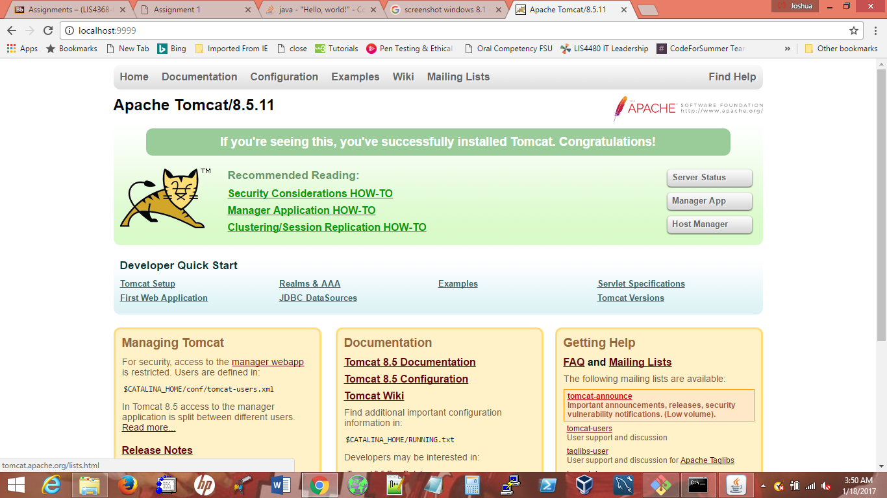

> **NOTE:** This README.md file should be placed at the **root of each of your repos directories.**
>
>Also, this file **must** use Markdown syntax, and provide project documentation as per below--otherwise, points **will** be deducted.
>

# LIS4368

## Josh Howell

### Assignment # Requirements:

*Sub-Heading:*

1. Distributed Version Control with Git and Bitbucket
2. Java/JSP/Servlet Development Installation
3. Chapter Questions (Chs 1 - 4)

#### README.md file should include the following items:

* Screenshot of running java Hello program
* Screenshot of running http://localhost:9999
* git commands w/ short descriptions
* Bitbucket repo links: a) this assignment and b) the completed tutorial above

> This is a blockquote.
> 
> This is the second paragraph in the blockquote.
>
> #### Git commands w/short descriptions:

1. git init - Used to create an empty Git repository or reinitialize an existing one
2. git status - Shows the working tree status
3. git add - Add file content to the index
4. git commit - Record changes to the repository
5. git push - Update remote refs along with the associated objects
6. git pull - Fetch from and integrate with anothe repository or a local branch
7. git clone - Clones a repository into a new directory

#### Assignment Screenshots:

*Screenshot of AMPPS running http://localhost*:

*Screenshot of running java Hello*:

*Screenshot of Android Studio - My First App*:

#### Tutorial Links:

*Bitbucket Tutorial - Station Locations:*
[A1 Bitbucket Station Locations Tutorial Link](https://bitbucket.org/jch10g/bitbucketstationlocations/ "Bitbucket Station Locations")

*Tutorial: Request to update a teammate's repository:*
[A1 My Team Quotes Tutorial Link](https://bitbucket.org/jch10g/myteamquotes/ "My Team Quotes Tutorial")
