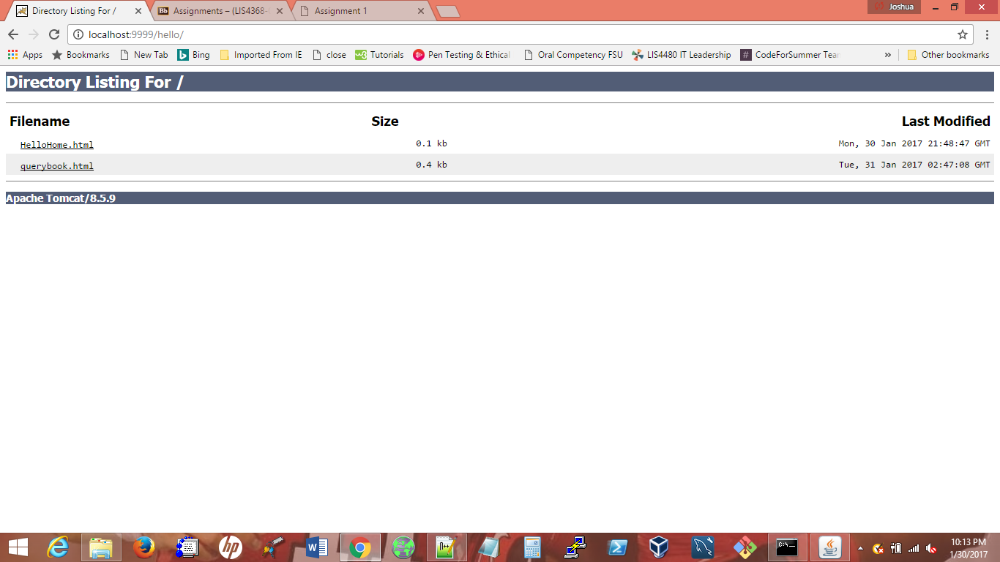
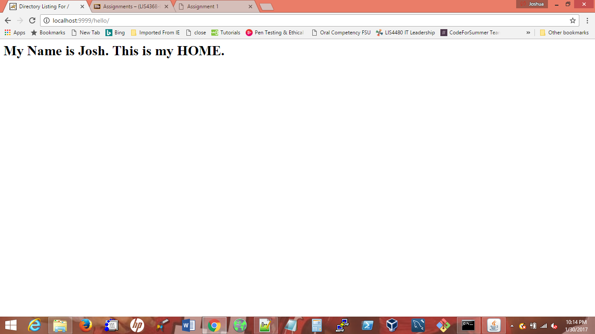
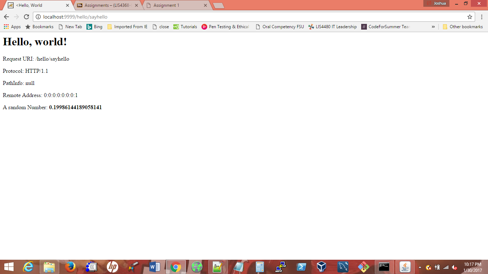
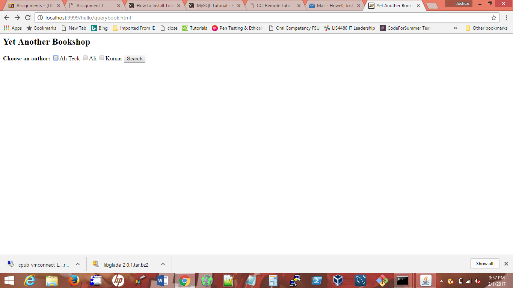
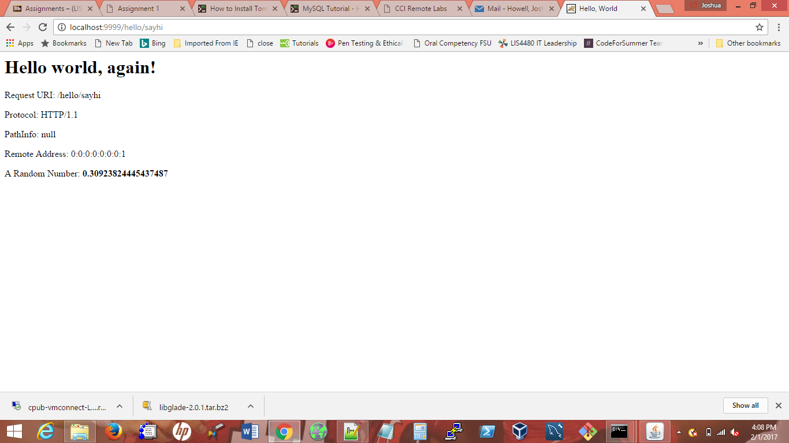
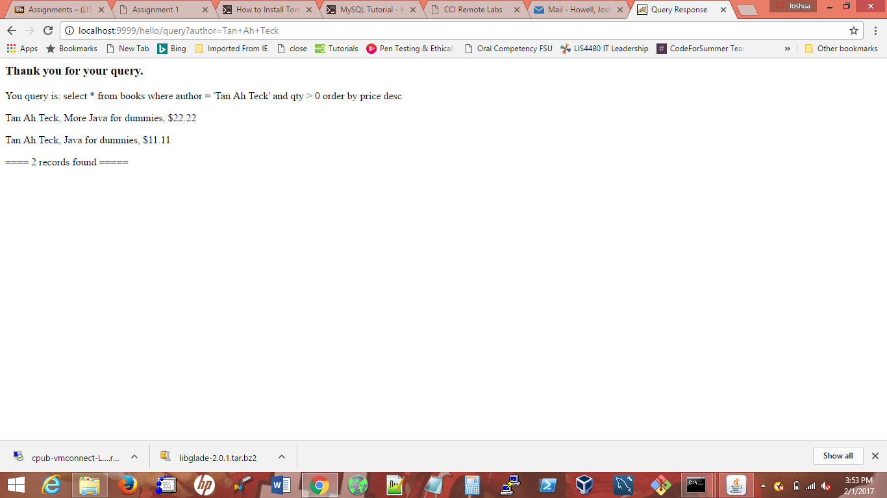

> **NOTE:** This README.md file should be placed at the **root of each of your repos directories.**
>
>Also, this file **must** use Markdown syntax, and provide project documentation as per below--otherwise, points **will** be deducted.
>

# LIS4368

## Josh Howell

### Assignment 2 Requirements:

*Sub-Heading:*

1. Mysql installation
2. Set up database and database driven-app
3. Chapter Questions (Chs 5 - 6)

#### README.md file should include the following items:

* Assessment links, and
* Screenshot of the query results from the following link: http://localhost:9999/hello/querybook.html

> This is a blockquote.
> 
> This is the second paragraph in the blockquote.
>
>

#### Assignment Screenshots:

*Screenshot of http://localhost:9999/hello*:

*Screenshot of http://localhost:9999/hello/HelloHome.html*:

*Screenshot of http://localhost:9999/hello/sayhello*:

*Screenshot of http://localhost:9999/hello/querybook.html*:

*Screenshot of http://localhost:9999/hello/sayhi*:

*Screenshot of http://localhost:9999/hello/querybook.html*:

#### Tutorial Links:

