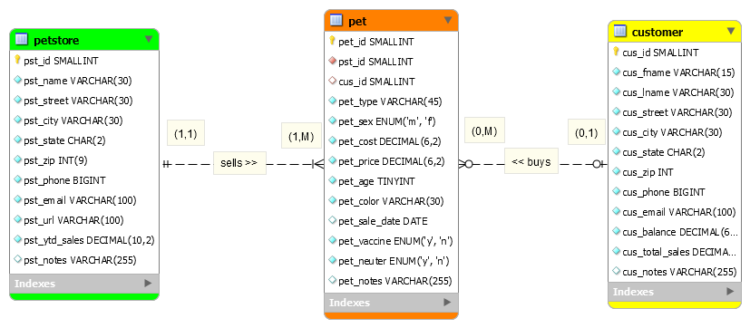

> **NOTE:** This README.md file should be placed at the **root of each of your repos directories.**
>
>Also, this file **must** use Markdown syntax, and provide project documentation as per below--otherwise, points **will** be deducted.
>

# LIS4368

## Josh Howell

### Assignment 3 Requirements:

*Sub-Heading:*

1. Design database according to the given business rules
2. Create ERD with appropriate tables and data
3. Chapter Questions (Chs 7 - 8)

#### Assignment Screenshots:

*Screenshot of pet store ERD*:

#### Tutorial Links:

*Bitbucket Tutorial - Station Locations:*
[A3 mwb requirement](https://bitbucket.org/jch10g/lis4368/src/0f6c8343f51306747916b1902856a4f0c48a4da9/a3/a3.mwb?at=master&fileviewer=file-view-default "a3.mwb")

*Tutorial: Request to update a teammate's repository:*
[A3 sql requirement](https://bitbucket.org/jch10g/lis4368/src/0f6c8343f51306747916b1902856a4f0c48a4da9/a3/a3.sql?at=master&fileviewer=file-view-default "a3.sql")
