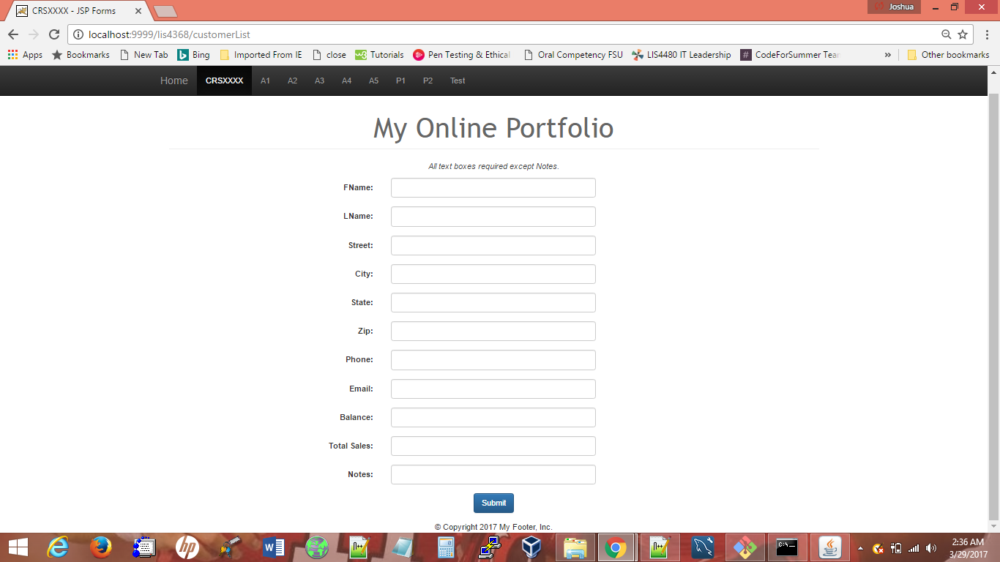
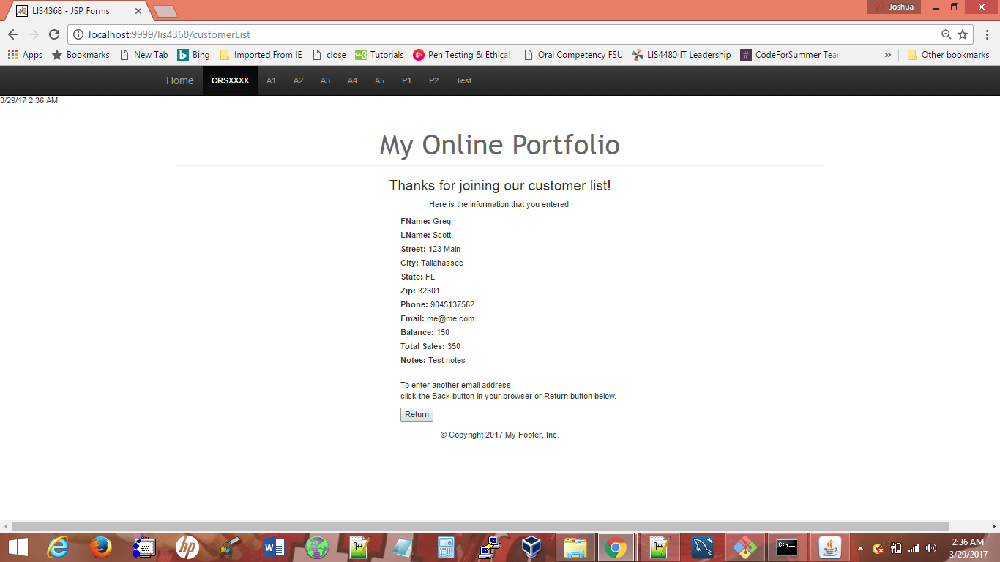

> **NOTE:** This README.md file should be placed at the **root of each of your repos directories.**
>
>Also, this file **must** use Markdown syntax, and provide project documentation as per below--otherwise, points **will** be deducted.
>

# LIS4368

## Josh Howell

### Assignment 4 Requirements:

*Sub-Heading:*

1. Model View Controller (MVC) Model
2. Modify java and jsp files
3. Chapter Questions (Chs 11, 12)

#### Assignment Screenshots:

*Screenshot of failed validation*:

*Screenshot of successful validation

#### Tutorial Links:

*Assignment 4 bitbucket link:*
[A4 bitbucket link](https://bitbucket.org/jch10g/lis4368 "bitbucket repo")

