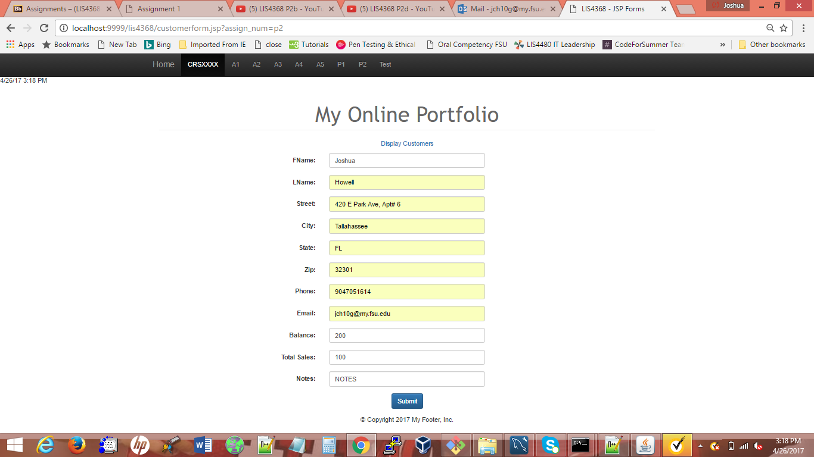
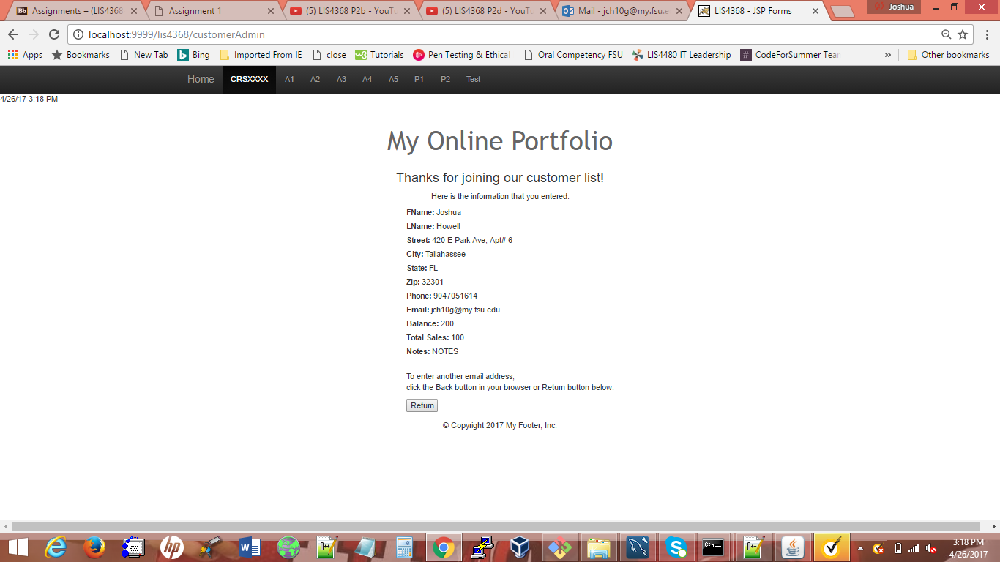
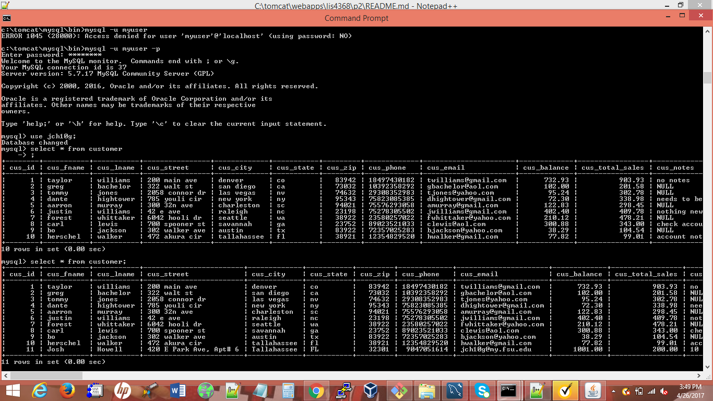

> **NOTE:** This README.md file should be placed at the **root of each of your repos directories.**
>
>Also, this file **must** use Markdown syntax, and provide project documentation as per below--otherwise, points **will** be deducted.
>

# LIS4368

## Josh Howell

### Project 2 Requirements:

*Sub-Heading:*

1. Add a modify page
2. Allows user to add, delete, or modify someone
3. Both client side and server side validation
3. Chapter Questions (Chs 16-17)

#### Assignment Screenshots:

*Screenshot of valid user form entry*:

*Screenshot of passed validation*

*Screenshot of database change*

*Screenshot of displayed data*

*Screenshot of modified form*

*Screenshot of modified data*

*Screenshot of delete warning*

#### Tutorial Links:

*Project 2 bitbucket link:*
[A4 bitbucket link](https://bitbucket.org/jch10g/lis4368 "bitbucket repo")

